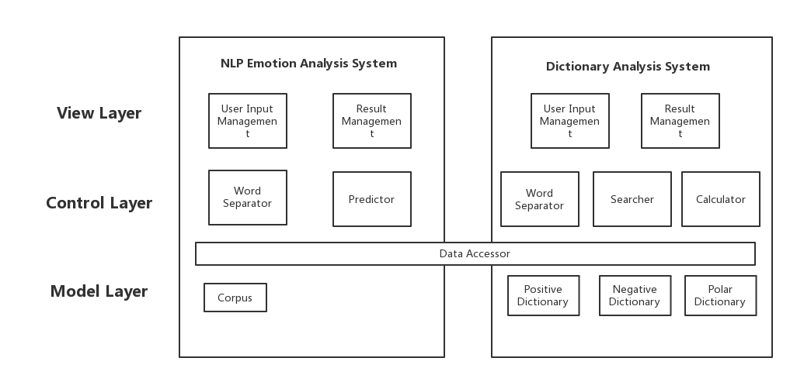
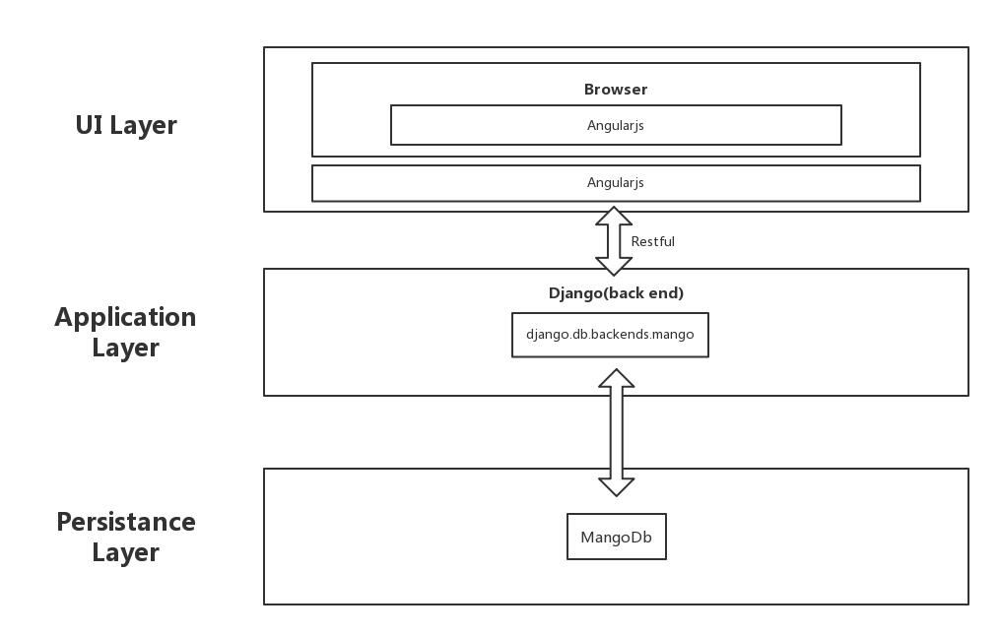

# High-level Design (概要设计规约)

## Prototype Design (原型设计)


## Business Architecture (业务架构)



## Technology Architecture (技术架构)



## Deployment Topology (部署结构)


## 数据建模

项目使用的是mongodb ,  是 nosql 数据库,  不是传统关系型数据库,  所以没有E-R图


### 数据库设计

本系统使用的mongodb 数据库, 主要存储了 **情感词典**、**测试样例**等方面数据


#### 情感词典

* 情感词典分为 主情感词典 和 分情感词典

* 一个主情感词典由一至多个分情感词典组成

* 分词典的条目数有一定限制, 在3000以内

* 示例:

  ``` 
  {
  	主词典名: "知网Hownet词典",

  	分词典集合 : [ "程度副词词典", "否定词词典", "正向情感词典", "负向情感词典"]
  }
  ```

* 设计

  * 一个主词典对应一个collection

  * 一个分词典对应一个collection中的一个document

  * 分词典词条数限制为 5000

  * 分词典中的词条 分页 存储, 每100 一页, 共有50页

  * 分词典描述表 : 

    | field             | Type   | description |
    | ----------------- | ------ | ----------- |
    | _id               |        |             |
    | part_dic_name     | string | 分词典名称       |
    | author            | string | 创建人         |
    | create_time       | Date   | 创建时间        |
    | last_changed_time | Date   | 最近修改时间      |
    | page_1            | []     | 文档列表        |
    | page_2            | []     | 文档列表        |
    | ...               |        | 一共由50个page  |
    | page_50           | []     | 文档列表        |

  * 示例 : 知网Hownet情感词典 ( 最外层 "{}" 表示这是一个collection )

    ```
    {
    	{
    		_id : 0,
    		main_dic_name : "知网Hownet情感词典" ,
    		author : "huzehao",
    		create_time :  ISODate("2013-02-22T03:03:37.312Z"),
    		last_changed_time :  ISODate("2013-02-22T03:03:37.312Z"),
    		part_dic : [ "程度副词词典", "否定词词典", "正向情感词典", "负向情感词典"]
    	}
    	
    	{
    		_id : 1,
    		part_dic_name : "程度副词词典",
    		author : "huzehao",
    		create_time : ISODate("2013-02-22T03:03:37.312Z"),
    		last_changed_time : ISODate("2013-02-22T03:03:37.312Z"),
    		page_1 : [{},{},...,{}],
    		page_2 : [{},{},...,{}],
    		...
    		page_50 : [{},{},...,{}]
    	}
    	
    	{
    		_id : 1,
    		part_dic_name : "否定词词典",
    		author : "huzehao",
    		create_time : ISODate("2013-02-22T03:03:37.312Z"),
    		last_changed_time : ISODate("2013-02-22T03:03:37.312Z"),
    		page_1 : [{},{},..,{}],
    		page_2 : [],
    		...
    		page_50 : []
    	}
    	...
    }
    ```


#### 测试样例

* 样例分为 :

  * 待审核样例 ( 未被管理员审核 ) 

  * 已审核样例 : 

    * 无效样例 ( 被管理员否决的样例 )
    * 有效样例 ( 被管理员认可的样例 ) 
      * 测出程序错误的样例 ; 
        * 可以对程序出错的原因进行归纳, 分组
      * 未测出程序错误的样例 ; 

  ​

* 样例包含两个字段 : 

  * 情感极性  :   正向 或 负向 ; 
  * 文本 :  中文字符串 ; 

* 设计 : 

  * 待审核样例存放在一个 collection 中 ;

  * 有效样例存放在一个collection 中 ;

  * 测出程序出错的样例和出错原因分组放在一个collection 中 ; 

  * 样例用一个 document 表示 ; 

  * 字段设计 : 

    1. waiting_test_sample  ( 待测试样例 )

       | Field            | Type    | Description                       |
       | ---------------- | ------- | --------------------------------- |
       | _id              | integer | 待测试样例ID                           |
       | emotion_extremum | integer | 待测试样例文本情感极值: 1为正, -1为负            |
       | text             | String  | 待测试样例文本                           |
       | verify_result    | Integer | 审核结果 : 1 : 有效 ; -1 : 无效 ; 0 : 未审核 |

       ```
       {
       	{
       		_id : 0
       		emo_extremum : 1,
       		text : "你好漂亮呀!",
       		verify_result : 0
       	}
       	
       	{
       		_id : 1
       		emo_extremum : 1,
       		text : "你好可爱呀!",
       		verify_result : 0
       	}
       	...
       	
       }
       ```

       ​

    2. correct_test_sample ( 管理员认可有效的样例 )

       | Field            | Type    | Description                              |
       | ---------------- | ------- | ---------------------------------------- |
       | _id              | integer | 待测试样例ID                                  |
       | emotion_extremum | integer | 待测试样例文本情感极值: 1为正, -1为负                   |
       | text             | String  | 待测试样例文本                                  |
       | test_result      | Integer | 测试结果 : 1 : 测出了系统的漏洞 ; -1 : 没有测出系统的漏洞 ; 0 : 未测试 |

       ```
       {
       	{
       		_id : 0
       		emo_extremum : 1,
       		text : "你好漂亮呀!",
       		test_result : 0
       	}
       	
       	{
       		_id : 1
       		emo_extremum : 1,
       		text : "你好可爱呀!",
       		test_result : 0
       	}
       	...
       	
       }
       ```

       ​

    3. effective_test_sample ( 测出了程序漏洞的样例 )

       | Field            | Type    | Description                              |
       | ---------------- | ------- | ---------------------------------------- |
       | _id              | Integer | 文档表示ID                                   |
       | emotion_extremum | Integer | 情感极值 :  -1 为负向情感 ; 1 为正向情感               |
       | text             | String  | 中文文本                                     |
       | test_information | doc     | 测试过程中的中间信息示例 :  ( 最外层 "{}" 表示 这是一个 collection ) |
       | error_type       | list    | 程序出错的原因                                  |

       ```
       {
       	{
       		_id : 0
       		emo_extremum : 1,
       		text : "你好漂亮呀!",
       		test_information : {
       			group:  "你好漂亮啊", 
       			stack: [[1]],
                	 wordlist:  [{'n': '你好', 'k': 'l', 's': 0, 'p': None}, 
              					{'n': '漂亮', 'k': 'a', 's': 1, 'p': 'pos'}, 
                				{'n': '啊', 'k': 'zg', 's': 0, 'p': None}],
       			pair:  ('漂亮', '你') 
       		error_type : []	
       		
       	}
       	
       	{
       		_id : 1
       		emo_extremum : 1,
       		text : "你好可爱呀!",
       		test_information : {
       			group:  "你好可爱啊", 
       			stack: [[1]],
                	 wordlist:  [{'n': '你好', 'k': 'l', 's': 0, 'p': None}, 
              					{'n': '可爱', 'k': 'a', 's': 1, 'p': 'pos'}, 
                				{'n': '啊', 'k': 'zg', 's': 0, 'p': None}],
       			pair:  ('漂亮', '你') }
       		error_type : []	
       	}
       	...
       	
       }
       ```

       ​

    4. error_group ( 程序出错原因分组 )

    | Field           | Type    | Description |
    | --------------- | ------- | ----------- |
    | _id             | Integer | 文档表示ID      |
    | group_name_list | String  | 分组名         |
    |                 |         |             |

  * 示例 : 

    1. ​

    ``` 
    {
    	_id : 0,
    	group_name_list : ["词典问题", "训练模型问题", "算法问题"]
    }

    ```

    ​


## 接口规约

### *dictionary/main_dictionary*

#### 接口描述

添加一个主词典

|                |          |
| -------------- | -------- |
| Request Method | POST     |
| Authorization  | Required |

#### 参数

| Name   | Located in | Description | Required | Schema |
| ------ | ---------- | ----------- | -------- | ------ |
| name   | form       | 主词典名        | Yes      | String |
| author | form       | 作者          | No       | String |


#### 返回结果

| Code | Description         | Schema |
| ---- | ------------------- | ------ |
| 200  | Successful response | String |

#### 示例请求

```
post dictionary/main_dictionary
body: form_data : name = asdf
                  author = admin
```

#### 示例结果

```
{
  code : 200
  message : create dictionary successfully!
  data : null
}
```


### *dictionary/main_dictionary/{id}*

#### 接口描述

替换给定ID主词典的信息

|                |          |
| -------------- | -------- |
| Request Method | PUT      |
| Authorization  | Required |

#### 参数

| Name   | Located in | Description | Required             | Schema  |
| ------ | ---------- | ----------- | -------------------- | ------- |
| id     | path       | 主词典 id      | Yes                  | Integer |
| name   | form       | 主词典 名称      | author 和 name 必须要有一个 | String  |
| author | form       | 主词典 作者      | author 和 name 必须要有一个 | String  |


#### 返回结果

| Code | Description         | Schema |
| ---- | ------------------- | ------ |
| 200  | Successful response | String |

#### 示例请求

```
PUT dictionary/main_dictionary/0/

```

#### 示例结果

```
{
  code : 200,
  message : "put successfully",
  data : null 
}
```


### *dictionary/main_dictionary/{id}*

#### 接口描述

删除给定ID主词典的信息

|                |          |
| -------------- | -------- |
| Request Method | DELETE   |
| Authorization  | Required |

#### 参数

| Name | Located in | Description | Required | Schema  |
| ---- | ---------- | ----------- | -------- | ------- |
| id   | Path       | 主词典 id      | Yes      | Integer |


#### 返回结果

| Code | Description         | Schema |
| ---- | ------------------- | ------ |
| 200  | Successful response | String |

#### 示例请求

```
DELETE dictionary/main_dictionary/0/
```

#### 示例结果

```
{
  code : 200,
  message : "delete successfully",
  data : null 
}
```


### *dictionary/main_dictionary/{id}* 

#### 接口描述

获取给定id主词典的信息

|                |          |
| -------------- | -------- |
| Request Method | Get      |
| Authorization  | Required |

#### 参数

| Name | Located in | Description | Required | Schema  |
| ---- | ---------- | ----------- | -------- | ------- |
| id   | query      | 主词典 id      | No       | Integer |


#### 返回结果

| Code | Description         | Schema |
| ---- | ------------------- | ------ |
| 200  | Successful response | String |

#### 示例请求

```
GET dictionary/main_dictionary/1/

```

#### 示例结果

```
{
		_id : 0,
		main_dic_name : "知网Hownet情感词典" ,
		author : "huzehao",
		create_time :  ISODate("2013-02-22T03:03:37.312Z"),
		last_changed_time :  ISODate("2013-02-22T03:03:37.312Z"),
		part_dic : [ "程度副词词典", "否定词词典", "正向情感词典", "负向情感词典"]
}

------------------------分割线--------------------------

[
	{
		_id : 0,
		main_dic_name : "知网Hownet情感词典" ,
		author : "huzehao",
		create_time :  ISODate("2013-02-22T03:03:37.312Z"),
		last_changed_time :  ISODate("2013-02-22T03:03:37.312Z"),
		part_dic : [ "程度副词词典", "否定词词典", "正向情感词典", "负向情感词典"]
	},
	{
	    _id : 1,
		main_dic_name : "清华李建军词典" ,
		author : "huzehao",
		create_time :  ISODate("2013-02-22T03:03:37.312Z"),
		last_changed_time :  ISODate("2013-02-22T03:03:37.312Z"),
		part_dic : [ "程度副词词典", "否定词词典", "正向情感词典", "负向情感词典"]
	}
	...
]
```


### *dictionary/main_dictionary/name*

#### 接口描述

获取所有主词典名

|                |              |
| -------------- | ------------ |
| Request Method | POST         |
| Authorization  | Not Required |

#### 参数

* 无


#### 返回结果

| Code | Description         | Schema                       |
| ---- | ------------------- | ---------------------------- |
| 200  | Successful response | *name_list* : list of string |

#### 示例请求

```
dictionary/main_dictionary/name

```

#### 示例结果

```
[ 
	"知网Hownet词典",
	"清华李建军词典"
]
```


### *dictionary/main_dictionary/{id}/part_dictionary/name*

#### 接口描述

获取给定ID主词典的所有分词典名

|                |          |
| -------------- | -------- |
| Request Method | Get      |
| Authorization  | Required |

#### 参数

| Name | Located in | Description | Required | Schema  |
| ---- | ---------- | ----------- | -------- | ------- |
| id   | path       | 主词典 id      | Yes      | Integer |


#### 返回结果

| Code | Description         | Schema                  |
| ---- | ------------------- | ----------------------- |
| 200  | Successful response | **lemma_list** ： String |

#### 示例请求

```
dictionary/0/part_dictionary/name

```

#### 示例结果

```
[ "程度副词词典", "否定词词典", "正向情感词典", "负向情感词典"]
	
	
```


### *dictionary/part_dictionary/{id}*

#### 接口描述

获取给定ID主词典的所有分词典名

|                |          |
| -------------- | -------- |
| Request Method | Delete   |
| Authorization  | Required |

#### 参数

| Name    | Located in | Description | Required | Schema  |
| ------- | ---------- | ----------- | -------- | ------- |
| part_id | path       | 分词典 id      | Yes      | Integer |


#### 返回结果

| Code | Description         | Schema                  |
| ---- | ------------------- | ----------------------- |
| 200  | Successful response | **lemma_list** ： String |

#### 示例请求

```
DELETE dictionary/part_dictionary/1

```

#### 示例结果

```
{
  code : 200,
  message : "delete part dictionary successfully",
  data : null 
}
	
```


### *dictionary/part_dictionary*

#### 接口描述

创建一个分词典

|                |          |
| -------------- | -------- |
| Request Method | POST     |
| Authorization  | Required |

#### 参数

| Name   | Located in | Description | Required | Schema  |
| ------ | ---------- | ----------- | -------- | ------- |
| id     | form       | 从属的主词典ID    | Yes      | Integer |
| name   | form       | 分词典名        | Yes      | String  |
| author | form       | 作者          | No       | String  |

#### 返回结果

| Code | Description         | Schema                  |
| ---- | ------------------- | ----------------------- |
| 200  | Successful response | **lemma_list** ： String |

#### 示例请求

```
POST dictionary/part_dictionary
BODY : FORM_DATA : id : 1
                   name : "create_by_huzehao"
                   author : "huzehao
```

#### 示例结果

```
{
  code : 200,
  message : "create part dictionary successfully",
  data : null 
}
```


### *dictionary/part_dictionary/{id}*

#### 接口描述

获取分词典的描述信息和一页词条

|                |          |
| -------------- | -------- |
| Request Method | GET      |
| Authorization  | Required |

#### 参数

| Name | Located in | Description | Required | Schema  |
| ---- | ---------- | ----------- | -------- | ------- |
| id   | path       | 分词典 id      | Yes      | Integer |
| page | query      | 分词典页数       | Yes      | Integer |

#### 返回结果

| Code | Description         | Schema                  |
| ---- | ------------------- | ----------------------- |
| 200  | Successful response | **lemma_list** ： String |

#### 示例请求

```
GET dictionary/part_dictionary/1?page=1

```

#### 示例结果

```
{
		_id : 1,
		part_dic_name : "程度副词词典",
		author : "huzehao",
		create_time : ISODate("2013-02-22T03:03:37.312Z"),
		last_changed_time : ISODate("2013-02-22T03:03:37.312Z"),
		page_1 : [{},{},...,{}],
}
	
```


### *dictionary/part_dictionary/{id}/page*

#### 接口描述

获取分词典的某一页词条

|                |          |
| -------------- | -------- |
| Request Method | GET      |
| Authorization  | Required |

#### 参数

| Name | Located in | Description | Required | Schema  |
| ---- | ---------- | ----------- | -------- | ------- |
| id   | path       | 分词典 id      | Yes      | Integer |
| page | query      | 分词典页数       | Yes      | Integer |

#### 返回结果

| Code | Description         | Schema                  |
| ---- | ------------------- | ----------------------- |
| 200  | Successful response | **lemma_list** ： String |

#### 示例请求

```
GET dictionary/part_dictionary/1/page?page=1

```

#### 示例结果

``` 
[
	{},
	{},
	...,
	{}
]
```


### *dictionary/part_dictionary/{id}*

#### 接口描述

修改分词典信息

|                |          |
| -------------- | -------- |
| Request Method | PUT      |
| Authorization  | Required |

#### 参数

| Name | Located in | Description | Required | Schema  |
| ---- | ---------- | ----------- | -------- | ------- |
| id   | path       | 分词典 id      | Yes      | Integer |

#### 返回结果

| Code | Description         | Schema                  |
| ---- | ------------------- | ----------------------- |
| 200  | Successful response | **lemma_list** ： String |

#### 示例请求

```
GET dictionary/part_dictionary/1/

```

#### 示例结果

```
{
  code : 200,
  message : "change part dictionary successfully",
  data : null 
}
```


### *dictionary/part_dictionary/{id}/page*

#### 接口描述

给分词典添加一页词条

|                |          |
| -------------- | -------- |
| Request Method | POST     |
| Authorization  | Required |

#### 参数

| Name | Located in | Description | Required | Schema  |
| ---- | ---------- | ----------- | -------- | ------- |
| id   | path       | 分词典 id      | Yes      | Integer |
| page | form       | 页数          | Yes      | Integer |

#### 返回结果

| Code | Description         | Schema                  |
| ---- | ------------------- | ----------------------- |
| 200  | Successful response | **lemma_list** ： String |

#### 示例请求

```
GET dictionary/part_dictionary/1/page?page=1

```

#### 示例结果

```
{
  code : 200,
  message : "create part dictionary page successfully",
  data : null 
}
```


### *dictionary/part_dictionary/{id}/{page}*

#### 接口描述

修改分词典某一页词条

|                |          |
| -------------- | -------- |
| Request Method | PUT      |
| Authorization  | Required |

#### 参数

| Name | Located in | Description | Required | Schema  |
| ---- | ---------- | ----------- | -------- | ------- |
| id   | path       | 分词典 id      | Yes      | Integer |
| page | path       | 页数          | Yes      | Integer |
|      |            |             |          |         |

#### 返回结果

| Code | Description         | Schema                  |
| ---- | ------------------- | ----------------------- |
| 200  | Successful response | **lemma_list** ： String |

#### 示例请求

```
PUT dictionary/part_dictionary/1/

```

#### 示例结果

```
{
  code : 200,
  message : "change part dictionary successfully",
  data : null 
}
```


