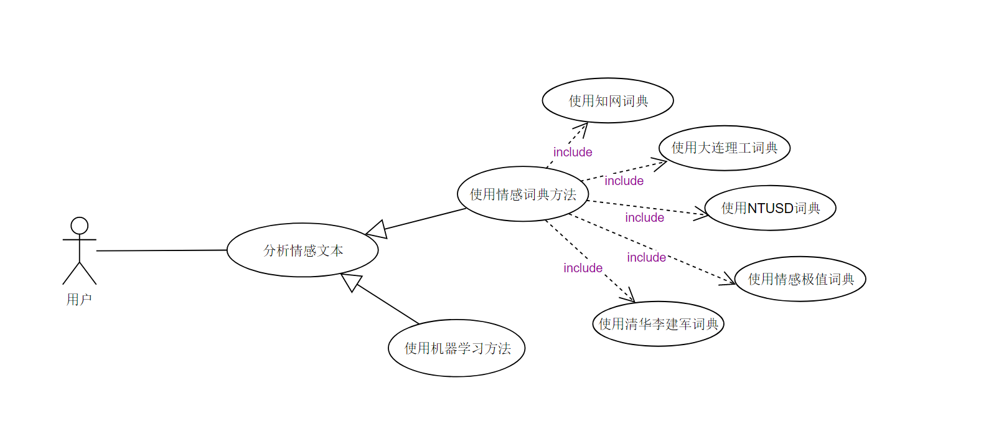

# 需求规约

## 项目介绍

### 项目背景

​      文本情感分析又称意见挖掘， 是对包含用户观点、 喜好、 情感等主观性文本进行挖掘、 分析

及判别它是一个多学科交叉的研究领域， 涉及**概率论**、 **数据统计分析**、 **计算机语言学**、 **自然语言**

**处理**、 **机器学习**、 **信息检索**、 **本体学**   ( Ontology) 等多个学科及其相关技术 。鉴于其在用户

意见挖掘、 垃圾邮件过滤及舆情分析等 多个领域具有重要的应用价值， 文本情感分析正受到国内外

众多研究机构和学者的重视。

​      情感分析可归纳为情感信息抽取、 情感信息分类及情感信息的检索与归纳三项层层递进的研究任 

务 。本文研究的重点是情感信息分类， 旨在将文本情感分为褒义、 贬义两类或者更细致的情感类别。

按照分析文本的粒度不同， 情感信息分类可分为**词语级** 、 **短语级** 、 **句子级** 、 **篇章级** 等几个研究层

次。

​       

​      目前， 情感分类大致涌现出两种研究思路:  **基于情感知识** 和 **基于特征** 。

​      前者主要是基于已有的情感词典或情感知识库 对文本中带有情感或极性的词( 或词语单元) 进行加

权求和， 而后者主要是对文本提取具有类别表征意义的 特征， 再基于这些特征使用机器学习算法进

行分类。

### 项目目标

* 使用 机器学习 和 情感词典 这两种方法 分别对中文新闻类文本进行情感极性分析

* 输入一段新闻文本能够得到文本的情感极性

  ​

### 目标人群

* 需要对已有中文文本数据进行情感分析的企业及用户
* APP中需要集成中文文本情感分析功能的开发人员
* 从事中文文本情感分析与挖掘的研究人员

  ​

### 项目边界

本项目是一个向有中文文本情感分析需求的人员提供接口服务， 并尽可能提高服务质量的APP。

用户可以通过浏览我们的网站来体验我们的中文文本情感分析服务， 并且可以参与到我们的用户体验改善

计划中： 通过向系统机器学习方法接口传递一个已知情感极性的文本及其情感极性来不断训练我们的模型, 

同时也可以查看系统返回的分析结果向我们后台反馈错误, 错误样例被相应数据库所记录。

这样，我们可以不断修复导致用户反馈的错误的bug，以及使用日益完善的模型来不断提高我们向用户提供

的服质量。此外，需要在项目中使用中文文本情感分析功能的开发人员可以向我们申请服务接口来进一步使

用我们所提供的服务。

* #### what we can do 

  * 机器学习方法的接口，接受一个中文文本， 可得到一个正向情感极性的概率和负向情感

    的概率。

  * 基于情感词典的方法的接口， 输入一段中文文本， 可得到文本的情感极性分值 。

  * 可对 篇章级、段落级、句子级 的中文文本进行情感极性判断。

  * 基于情感词典的方法的接口，可以使用不同的情感词典对中文文本进行情感分析。

  * 基于机器学习的方法的接口，可以导入一个训练好的模型来对中文文本进行情感分析。

  * 提供了训练模型和测试准确率的接口， 方便开发者及用户测试我们算法，并汇报错误。

  * 提供了一个数据库用来记录常见的分析用语，以及分析错误的语句，便于开发者完善情感

    分析算法以及修复程序中的bug。

    ​

* #### what we cannot do

  * 无法识别除中文以外的其他语言的文本
  * 无法识别中文文本中的描述对象，无法得出所描述对象的情感极性值
  * 暂时无法对中文文本中蕴含的情感进行分类（喜怒哀乐等）

    ​

## 项目需求分析

### 系统KAOS图

## 用例分析

### 概述

* 本系统有2个参与者, 包括 **用户** , **管理员** 。 

* 用户为本系统所提供服务的使用者

  * 用户可以直接使用系统所暴露的情感分析接口向后台传递一个中文字符串，从而获得一个文本的正负向情感结果；
  * 用户也可以对系统返回的结果进行判断并反馈错误, 具体操作如下
    1. 在文本框输入一段已知情感正负向的中文文本并且提供这段文本的正负向情感信息, 来获取结果。
    2. 用户判断系统返回的情感分析结果有误, 点击文本框下方的反馈错误按钮, 反馈错误样例
    3. 系统会自动的将用户所提供的错误样例的信息插入到“待审核样例数据库” 中， 并通知管理员去审核。
    4. 管理员在审核错误样例, 系统得到每条待审核错误样例的审核结果
       1. 如果错误样例的审核结果是 : 有效,   那么这条错误样例将被记录到错误样例数据库中
    5. 被管理员审核过的待审核测试样例从待审核样例数据库中删除

  ​

* 管理员为本系统的管理人员。

  * 管理员也可以通过情感词典管理模块来对情感词典进行修改等操作

  * 管理员还可以审核用户反馈的错误样例，和直接访问控制系统样例数据数据库, 对系统的样例进行管理,

    以方便开发人员修复系统的漏洞, 进一步提高系统提供的服务质量

    ​

-----

### 系统用例总图

​                                                   

​										图1- 系统用例 总图

---

### 详述

​                     

&nbsp;										图2 -  分析情感文本 -  用例

​                         

### 父用例: _分析情感文本_

#### 描述对象

* 分析情感文本

#### 标识符

* UC00

#### 说明

* 用户使用系统的官方网站上提供的接口输入文本信息, 或使用系统所提供的url接口进行post中文字符串

​       来获取情感分析结果

#### 参与者

* 用户

#### 频度

* 高

#### 状态

* 通过

#### 前置条件

* 网络连接成功
* 用户访问了我们的网站
* 用户在开发应用中正确的使用了我们所提供的URL, 以正确的方式进行了Http请求

#### 后置条件

* 用户所访问的我们网站的页面上显示了,用户所提交文本的情感的正负向信息
* 用户的目标应用将接受到一个表示其所提交的文本的情感的正负向信息

#### 被扩展的用例

* 无

#### 被包含的用例

* 无

#### 可选操作流程

------

### 子用例: _使用机器学习方法_

#### 描述对象

* 使用机器学习方法

#### 标识符

* UC01

#### 说明

* 用户使用系统的官方网站上提供的"使用情感词典方法的文本情感极值分析接口"输入文本信息
* 用户使用系统所提供的"情感词典的文本情感极值分析接口"的URL进行post字符串
* 用户收到所提交的中文字符串在进行情感分析后的结果

#### 参与者

* 用户

#### 频度

* 高

#### 状态

* 通过

#### 前置条件

* 网络连接成功
* 使用访问网站的方式:
  * 用户访问了我们的网站
  * 用户在机器学习栏目的文本输入框内输入了一段中文字符串
* 使用发送Http 请求的方式
  * 用户的网络请求代码里正确使用了我们所提供的URL
  * 用户使用Post方式以我们提供的URL来提交一个中文字符串

#### 后置条件

* 用户所访问的我们网站的页面上显示了,用户所提交文本的情感的正负向信息
* 用户的目标应用将接受到一个表示其所提交的文本的情感的正负向信息

#### 被扩展的用例

* 无

#### 被包含的用例

* 无

#### 基本操作流程

* 使用访问网页的方式

  1. 用户打开我们网站 
  2. 用户在网站的情感词典接口栏目相应的文本输出栏内输入所要分析的中文文本

* 使用URL发送Http请求的方式

  1. 在应用程序中添加 网络请求 方面的代码, 使用post的方式向

     传递一个中文字符串

#### 可选操作流程

* 滚动鼠标滑轮

* 用户可以在情感词典栏目输入需要进行情感分析的中文字符串来获得情感分析结果

  ​

-------

### 子用例: _使用情感词典方法_

#### 描述对象

* 使用情感词典方法

#### 标识符

* UC02

#### 说明

* 用户使用系统的官方网站上提供的"使用机器学习方法的文本情感极值分析接口"输入文本信息
* 用户使用系统所提供的"使用机器学习方法的文本情感极值分析接口"的URL进行post字符串
* 用户收到所提交的中文字符串在进行情感分析后的结果

#### 参与者

* 用户

#### 频度

* 高

#### 状态

* 通过

#### 前置条件

* 网络连接成功
* 使用访问网站的方式:
  * 用户访问了我们的网站
  * 用户在机器学习栏目的文本输入框内输入了一段中文字符串
* 使用发送Http 请求的方式
  * 用户的网络请求代码里正确使用了我们所提供的URL
  * 用户使用Post方式以我们提供的URL来提交一个中文字符串

#### 后置条件

* 用户所访问的我们网站的页面上显示了,用户所提交文本的情感的正负向信息
* 用户的目标应用将接受到一个表示其所提交的文本的情感的正负向信息

#### 被扩展的用例

* 无

#### 被包含的用例

* 使用知网词典
* 使用大连理工词典
* 使用NTUSD词典
* 使用清华李建军词典
* 使用情感极值词典

#### 基本操作流程

* 使用访问网页的方式

  1. 用户打开我们的网站
  2. 用户在网站的机器学习接口栏目相应的文本输出栏内输入所要分析的中文文本

* 使用URL发送Http请求的方式

  1. 在应用程序中添加 网络请求 方面的代码, 使用post的方式向

     传递一个中文字符串

#### 可选操作流程

* 用户可以点击反馈错误按钮反馈错误

----

### 被包含用例: _使用知网词典_

#### 描述对象

* 使用知网词典

#### 标识符

 * UC03

#### 说明

* 用户在使用情感词典情感分析接口的时候可以选择使用的词典为知网词典来进行情感分析

#### 参与者

* 用户

#### 频度

* 高

#### 状态

* 通过

#### 前置条件

* 网络连接成功
* 用户通过访问我们的网页或使用Http请求的方法来与我们的接口交互
* 用户选择了使用情感词典方法的接口

#### 后置条件

* 用户所访问的我们网站的页面上显示了, 用户所提交文本的情感的正负向信息
* or
* 用户的目标应用将接受到一个表示其所提交的文本的情感的正负向信息

#### 被扩展的用例

* 无

#### 被包含的用例

* 无

#### 基本操作流程

* 使用访问网页的方式
  1. 用户打开我们服务提供网页 
  2. 用户在情感词典方法接口的左上角下拉框中选择使用知网情感词典
  3. 用户在网站的接口栏目相应的文本输出栏内输入所要分析的中文文本
* 使用URL发送Http请求的方式
  1. 在应用程序中添加 网络请求 方面的代码, 使用post的方式向传递一个中文字符串

#### 可选操作流程

* 用户可以点击反馈错误按钮反馈错误

----

### 被包含用例: _使用大连理工词典_

#### 描述对象

* 使用大连理工词典

#### 标识符

* UC04

#### 说明

* 用户在使用情感词典情感分析接口的时候可以选择使用的词典为大连理工词典来进行情感分析

#### 参与者

* 用户

#### 频度

* 高

#### 状态

* 通过

#### 前置条件

* 网络连接成功
* 用户通过访问我们的网页或使用Http请求的方法来与我们的接口交互
* 用户选择了使用情感词典方法的接口

#### 后置条件

* 用户所访问的我们网站的页面上显示了, 用户所提交文本的情感的正负向信息
* or
* 用户的目标应用将接受到一个表示其所提交的文本的情感的正负向信息

#### 被扩展的用例

* 无

#### 被包含的用例

* 无

#### 基本操作流程

* 使用访问网页的方式
  1. 用户打开我们服务提供网页 
  2. 用户在情感词典方法接口的左上角下拉框中选择使用大连理工情感词典
  3. 用户在网站的接口栏目相应的文本输出栏内输入所要分析的中文文本
* 使用URL发送Http请求的方式
  1. 在应用程序中添加 网络请求 方面的代码, 使用post的方式向传递一个中文字符串

#### 可选操作流程

* 用户可以点击反馈错误按钮反馈错误

---

### 被包含用例: _使用 NTUSD词典_

#### 描述对象

* 使用NTUSD词典

#### 标识符

* UC05

#### 说明

* 用户在使用情感词典情感分析接口的时候可以选择使用的词典为NTUSD词典来进行情感分析

#### 参与者

* 用户

#### 频度

* 高

#### 状态

* 通过

#### 前置条件

* 网络连接成功
* 用户通过访问我们的网页或使用Http请求的方法来与我们的接口交互
* 用户选择了使用情感词典方法的接口

#### 后置条件

* 用户所访问的我们网站的页面上显示了, 用户所提交文本的情感的正负向信息
* or
* 用户的目标应用将接受到一个表示其所提交的文本的情感的正负向信息

#### 被扩展的用例

* 无

#### 被包含的用例

* 无

#### 基本操作流程

* 使用访问网页的方式
  1. 用户打开我们服务提供网页 
  2. 用户在情感词典方法接口的左上角下拉框中选择使用NTUSD词典
  3. 用户在网站的接口栏目相应的文本输出栏内输入所要分析的中文文本
* 使用URL发送Http请求的方式
  1. 在应用程序中添加 网络请求 方面的代码, 使用post的方式向传递一个中文字符串

#### 可选操作流程

* 用户可以点击反馈错误按钮反馈错误

----

### 被包含用例: _使用清华李建军词典_

#### 描述对象

* 使用清华李建军词典

#### 标识符

* UC06

#### 说明

* 用户在使用情感词典情感分析接口的时候可以选择使用的词典为清华李建军词典来进行情感分析

#### 参与者

* 用户

#### 频度

* 高

#### 状态

* 通过

#### 前置条件

* 网络连接成功
* 用户通过访问我们的网页或使用Http请求的方法来与我们的接口交互
* 用户选择了使用情感词典方法的接口

#### 后置条件

* 用户所访问的我们网站的页面上显示了, 用户所提交文本的情感的正负向信息
* or
* 用户的目标应用将接受到一个表示其所提交的文本的情感的正负向信息

#### 被扩展的用例

* 无

#### 被包含的用例

* 无

#### 基本操作流程

* 使用访问网页的方式
  1. 用户打开我们服务提供网页 
  2. 用户在情感词典方法接口的左上角下拉框中选择使用清华李建军情感词典
  3. 用户在网站的接口栏目相应的文本输出栏内输入所要分析的中文文本
* 使用URL发送Http请求的方式
  1. 在应用程序中添加 网络请求 方面的代码, 使用post的方式向传递一个中文字符串

#### 可选操作流程

* 用户可以点击反馈错误按钮反馈错误

---

### 被包含用例: _使用情感极值词典_

#### 描述对象

* 使用情感极值词典

#### 标识符

* UC07

#### 说明

* 用户在使用情感词典情感分析接口的时候可以选择使用的词典为情感极值词典来进行情感分析

#### 参与者

* 用户

#### 频度

* 高

#### 状态

* 通过

#### 前置条件

* 网络连接成功
* 用户通过访问我们的网页或使用Http请求的方法来与我们的接口交互
* 用户选择了使用情感词典方法的接口

#### 后置条件

* 用户所访问的我们网站的页面上显示了, 用户所提交文本的情感的正负向信息
* or
* 用户的目标应用将接受到一个表示其所提交的文本的情感的正负向信息

#### 被扩展的用例

* 无

#### 被包含的用例

* 无

#### 基本操作流程

* 使用访问网页的方式
  1. 用户打开我们服务提供网页 
  2. 用户在情感词典方法接口的左上角下拉框中选择使用情感极值情感词典
  3. 用户在网站的接口栏目相应的文本输出栏内输入所要分析的中文文本
* 使用URL发送Http请求的方式
  1. 在应用程序中添加 网络请求 方面的代码, 使用post的方式向传递一个中文字符串

#### 可选操作流程

* 用户可以点击反馈错误按钮反馈错误

----

​                                                                        图 5 - 反馈错误样例

### 用例: _反馈错误样例_

#### 描述对象

* 反馈错误样例

#### 标识符

* UC08

#### 说明

* 用户访问系统提供的网站, 使用测试接口, 在文本输入框里输入一个中文文本， 如果系统返回的结果不符合要求，则可以通过点击下方的反馈错误按钮反馈错误

#### 参与者

* 用户

#### 频度

* 高

#### 状态

* 通过

#### 前置条件

* 用户进入了系统提供的网站。

#### 后置条件

* 系统将受到用户反馈的错误样例：
* 系统将用户反馈的样例标记为待审核样例

#### 被扩展的用例

* 无

#### 被包含的用例

* 录入待审核测试样例

#### 基本操作流程

1. 用户访问系统提供的官方网站, 任意一个文本输入框内输入一段已知情感极性的中文文本
2. 系统返回给用户页面对该文本进行情感分析的结果
3. 用户审核这个结果有误，可以点击文本输入框下的”反馈错误“， 向系统反馈错误样例
4. 系统收到错误样例后， 将通知管理员对该测试样例进行审核
5. 管理员审核通过后将通知用户页面反馈已通过审核

#### 可选操作流程

* 无

-----

​                                                                 图 6 - 管理情感词典用例

### 主用例:  _管理情感词典_

#### 描述对象

* 情感词典管理

#### 标识符

* UC09

#### 说明

* 管理员通过情感词典管理用例对系统内部的情感词典进行调整， 从而改变系统所提供的基于词典的情感分析

  的接口服务的服务质量。

#### 参与者

* 管理员

#### 频度

* 中

#### 状态

* 通过

#### 前置条件

* 管理员登入情感词典管理页面

#### 后置条件

* 情感词典得到调整。

#### 被扩展的用例

* 无

#### 被包含的用例

* 添加词典

* 删除词典
* 修改词典
* 导入导出词典

#### 基本操作流程

1. 管理员登入情感词典管理页面。
2. 管理员在该页面的不同栏目进行系统所提供的可选操作。
3. 管理员在页面点击提交按钮。
4. 管理员在确认框内点击确认按钮。
5. 系统执行管理员的提交的操作命令。

#### 可选操作流程

* 管理员可以在提交前可以修改操作
* 管理员可以点击确认框的取消按钮取消本次操作

--------

​                                                               

​                                                   

### 用例:  _管理测试样例_ 

#### 描述对象

* 样例管理

#### 标识符

* UC10

#### 说明

* 管理员通过样例管理用例可以对系统的样例进行管理
* 系统的样例分为:
  * 测试样例
  * 待审核样例
  * 程序出错样例

#### 参与者

* 管理员

#### 频度

* 中

#### 状态

* 通过

#### 前置条件

* 管理员管理员进入了系统页面

#### 后置条件

* 系统样例得到了管理

#### 被扩展的用例

* 无

#### 被包含的用例

* 无

#### 被继承的用例

* 测试样例管理
* 待审核样例管理
* 程序出错样例管理

#### 基本操作流程

* 管理员进入系统管理页面
* 管理员在页面选择一个样例管理页面并进入
* 管理员根据页面所暴露的功能操作交互接口进行一系列操作
* 管理人点击页面的提交按钮, 并确认操作

#### 可选操作流程

* 管理员在提交后可以点击取消按钮来取消操作

---

### 用例:  _审核错误样例_

#### 描述对象

* 样例管理

#### 标识符

* UC11

#### 说明

* 管理员可以通过审核错误样例, 来向系统添加有效的错误样例, 以间接提高系统的准确度

**参与者** 

* 管理员

#### 频度

* 高

#### 状态

* 通过

#### 前置条件

* 管理员管理员进入了管理系统

#### 后置条件

* 待审核错误样例得到审核

#### 被扩展的用例

* 无

#### 被包含的用例

* 无

#### 基本操作流程

* 管理员进入系统待审核样例管理页面
* 页面显示一列未审核的错误样例
* 管理员点击每条样例的text域查看错误样例, 结合错误样例给出的情感极值判断错误样例是否有效
  * 如果有效 : 管理员点击样例右侧的有效选项
  * 如果无效 : 管理员点击样例右侧的无效选项
* 被审核的错误样例从待审核错误样例中删除
* 被判定有效的错误样例录入错误样例数据库

#### 可选操作流程

* 管理员可以以随意的顺序审核页面显示的错误样例